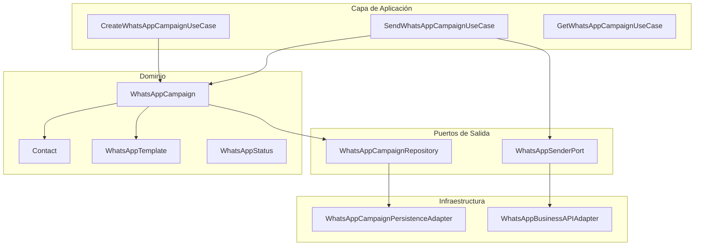

# Plan de Implementación: Campañas WhatsApp para MailBoom API

## 1. Análisis de Requisitos

### 1.1 Análisis del Contexto Actual

El proyecto actual tiene una arquitectura hexagonal bien definida:

| Componente | Ubicación | Descripción |
|------------|-----------|-------------|
| **Dominio** | `domain/model/` | Entidades inmutables con constructores factory |
| **Puertos de Entrada** | `application/*/port/in/` | Interfaces de casos de uso |
| **Puertos de Salida** | `domain/port/out/` | Interfaces para adaptadores externos |
| **Adaptadores** | `infrastructure/*/adapter/` | Implementaciones de puertos de salida |
| **Controladores** | `infrastructure/*/controller/` | Endpoints REST |

### 1.2 Diferencias Clave: Campañas Email vs WhatsApp

| Aspecto | Email (AWS SES) | WhatsApp |
|---------|-----------------|----------|
| **Destinatario** | Email (Contact.email) | Teléfono (Contact.phone) |
| **Contenido** | HTML con asunto | Template de WhatsApp Business |
| **Rate Limiting** | AWS SES: 50 emails/segundo | Meta: ~100 mensajes/segundo |
| **Estado de entrega** | Simple (enviado/error) | Estados complejos (sent, delivered, read, failed) |
| **Identidad del sender** | Email verificado en SES | Número de WhatsApp Business verificado |
| **Costo** | Por email enviado | Por mensaje de WhatsApp |

### 1.3 Rate Limiting de WhatsApp (Meta/Facebook)

La API de WhatsApp Business tiene las siguientes limitaciones:
- **Ventanas de 24 horas**: Límites basados en la categoría de negocio
- **Límites de velocidad**: ~100 mensajes por segundo en promedio
- **Plantillas aprobadas**: Solo mensajes iniciados por el usuario o plantillas pre-aprobadas
- **Conversaciones**: Cada conversación tiene un costo adicional

### 1.4 Value Objects Existentes Relevantes

- [`Phone.java`](src/main/java/com/mailboom/api/domain/model/common/valueobjects/Phone.java): **Ya existe** - representa números de teléfono (actualmente solo almacena números, no formato internacional)

---

## 2. Diseño de Arquitectura

### 2.1 Arquitectura Propuesta



### 2.2 Modelo de Dominio: WhatsAppCampaign

**Opción A: Nueva entidad separada (Recomendada)**

```
domain/model/whatsapp/
├── WhatsAppCampaign.java
├── valueobjects/
│   ├── WhatsAppCampaignId.java
│   ├── WhatsAppTemplateName.java
│   ├── WhatsAppTemplateParams.java
│   ├── WhatsAppPhoneNumber.java
│   └── WhatsAppCampaignStatus.java (extiende CampaignStatus)
```

**Diferencias con Campaign:**
- `HtmlContent` → `WhatsAppTemplateName` + `WhatsAppTemplateParams`
- `Subject` → No aplica (WhatsApp no tiene asunto)
- `EmailSenderIdentity` → `WhatsAppPhoneNumber` (número de negocio)
- `CampaignStatus` → Nuevo estado incluyendo `DELIVERED`, `READ`, `FAILED`

### 2.3 Puertos Necesarios

```java
// Puerto de salida para enviar mensajes WhatsApp
public interface WhatsAppSenderPort {
    void send(WhatsAppCampaign campaign, List<Contact> recipients);
    
    // Para obtener status de entrega
    WhatsAppMessageStatus getMessageStatus(String messageId);
}

// Puerto de salida para persistencia
public interface WhatsAppCampaignRepository {
    WhatsAppCampaign save(WhatsAppCampaign campaign);
    Optional<WhatsAppCampaign> findById(WhatsAppCampaignId id);
    List<WhatsAppCampaign> findAllByOwnerId(UserId ownerId);
    void deleteById(WhatsAppCampaignId id);
}
```

### 2.4 Adaptadores de Integración

**Proveedores disponibles:**
1. **WhatsApp Business API (Meta/Facebook)** - Oficial, mayor complejidad
2. **Twilio** - Más fácil de integrar, usa API de Meta por debajo
3. **Infobip** - Alternativa internacional

**Recomendación:** Comenzar con **Twilio** por simplicidad, o usar directamente la **API de Meta** si ya tienen experiencia.

---

## 3. Preguntas de Clarificación

Antes de proceder con la implementación, necesito respuestas a las siguientes preguntas:

### 3.1 Proveedor de WhatsApp

| Pregunta | Opciones |
|----------|----------|
| ¿Qué proveedor de WhatsApp vas a utilizar? | Meta WhatsApp Business API / Twilio / Infobip / Otro |

### 3.2 Datos de Integración

| Pregunta | Respuesta Esperada |
|----------|-------------------|
| ¿Cuál es el Phone Number ID de tu WhatsApp Business? | Número de teléfono registrado |
| ¿Cuál es el WhatsApp Business Account ID? | ID de la cuenta de negocio |
| ¿Tienes las credenciales de API de Meta (Access Token)? | Token de acceso |
| ¿O prefieres usar Twilio? Si es así, ¿tienes Account SID y Auth Token? | Credenciales de Twilio |

### 3.3 Estructura de Contactos

| Pregunta | Opciones |
|----------|----------|
| ¿Los contactos actuales tienen teléfono guardado? | Sí / No / Solo algunos |
| ¿Qué formato de teléfono usan actualmente? | Solo números / Con código de país / Con prefijo + |
| ¿Necesitas agregar un campo de teléfono a Contact si no existe? | Sí, obligatorio / Opcional |

### 3.4 Template de WhatsApp

| Pregunta | Respuesta Esperada |
|----------|-------------------|
| ¿Cuál es el nombre de la plantilla aprobada? | Nombre del template en Meta |
| ¿Qué parámetros acepta la plantilla? | Lista de variables {{1}}, {{2}}, etc. |
| ¿Los parámetros vienen de customFields del Contact? | Sí / No, especificar |

### 3.5 Límites y Cuotas

| Pregunta | Opciones |
|----------|----------|
| ¿Quieres agregar límites de WhatsApp similares a los de email en el plan? | Sí / No |
| ¿Cuál debería ser el límite mensual de WhatsApp por plan? | Mismo que email / Diferente |

---

## 4. Plan de Implementación por Fases

### Fase 1: Extensiones del Dominio

#### 1.1 Actualizar Phone Value Object
- Añadir validación de formato internacional (E.164)
- Soporte para código de país

```java
// Nuevo Phone.java должен validar formato E.164
public record Phone(String countryCode, int number) {
    public String toE164() { return "+" + countryCode + number; }
}
```

#### 1.2 Agregar phone a Contact
- Añadir campo phone al modelo Contact
- Actualizar ContactEntity con columna phone
- Actualizar comandos de creación de contacto

#### 1.3 Crear WhatsAppCampaign
- `WhatsAppCampaign.java` - entidad principal
- `WhatsAppCampaignId.java` - value object ID
- `WhatsAppTemplateName.java` - nombre del template
- `WhatsAppTemplateParams.java` - parámetros del template
- `WhatsAppCampaignStatus.java` - estados extendidos

**Archivos a crear:**
```
src/main/java/com/mailboom/api/domain/model/whatsapp/
├── WhatsAppCampaign.java
├── valueobjects/
│   ├── WhatsAppCampaignId.java
│   ├── WhatsAppTemplateName.java
│   ├── WhatsAppTemplateParams.java
│   └── WhatsAppCampaignStatus.java
```

---

### Fase 2: Puertos y Adaptadores

#### 2.1 Crear puertos de salida
```java
// domain/port/out/WhatsAppSenderPort.java
public interface WhatsAppSenderPort {
    void send(WhatsAppCampaign campaign, List<Contact> recipients);
}

// domain/port/out/WhatsAppCampaignRepository.java
public interface WhatsAppCampaignRepository {
    WhatsAppCampaign save(WhatsAppCampaign campaign);
    Optional<WhatsAppCampaign> findById(WhatsAppCampaignId id);
    List<WhatsAppCampaign> findAllByOwnerId(UserId ownerId);
    void deleteById(WhatsAppCampaignId id);
}
```

#### 2.2 Crear adaptador de WhatsApp
```
src/main/java/com/mailboom/api/infrastructure/whatsapp/
├── adapter/
│   └── TwilioWhatsAppAdapter.java  // O MetaWhatsAppAdapter.java
├── persistence/
│   ├── adapter/
│   │   └── WhatsAppCampaignRepositoryAdapter.java
│   ├── jpa/
│   │   ├── entity/
│   │   │   └── WhatsAppCampaignEntity.java
│   │   ├── mapper/
│   │   │   └── WhatsAppCampaignEntityMapper.java
│   │   └── repository/
│   │       └── SpringDataWhatsAppCampaignRepository.java
```

#### 2.3 Configuración
- Agregar propiedades para credenciales de WhatsApp
- Crear WhatsAppConfig.java con beans de cliente

---

### Fase 3: Casos de Uso (Application Layer)

#### 3.1 Puertos de entrada
```java
// application/whatsapp/port/in/
├── CreateWhatsAppCampaignUseCase.java
├── SendWhatsAppCampaignUseCase.java
├── GetWhatsAppCampaignUseCase.java
├── DeleteWhatsAppCampaignUseCase.java
└── GetWhatsAppCampaignsFromUserUseCase.java
```

#### 3.2 Implementaciones
```java
// application/whatsapp/usecase/
├── CreateWhatsAppCampaignUseCaseImpl.java
├── SendWhatsAppCampaignUseCaseImpl.java
├── GetWhatsAppCampaignUseCaseImpl.java
├── DeleteWhatsAppCampaignUseCaseImpl.java
└── GetWhatsAppCampaignsFromUserUseCaseImpl.java
```

#### 3.3 Commands
```java
// application/whatsapp/usecase/command/
├── CreateWhatsAppCampaignCommand.java
├── SendWhatsAppCampaignCommand.java
├── GetWhatsAppCampaignCommand.java
├── DeleteWhatsAppCampaignCommand.java
└── GetWhatsAppCampaignsFromUserCommand.java
```

---

### Fase 4: Controlador REST

```java
// infrastructure/whatsapp/controller/WhatsAppCampaignController.java

@RestController
@RequestMapping("/api/whatsapp-campaigns")
@PreAuthorize("hasAnyRole('ADMIN', 'USER')")
public class WhatsAppCampaignController {
    // POST /api/whatsapp-campaigns/new
    // GET /api/whatsapp-campaigns/user/{id}
    // GET /api/whatsapp-campaigns/{id}
    // PUT /api/whatsapp-campaigns/{id}/update
    // DELETE /api/whatsapp-campaigns/{id}/delete
    // POST /api/whatsapp-campaigns/{id}/send
}
```

#### 4.1 DTOs
```
infrastructure/whatsapp/dto/
├── NewWhatsAppCampaignRequest.java
├── NewWhatsAppCampaignResponse.java
├── WhatsAppCampaignDataResponse.java
├── SendWhatsAppCampaignRequest.java
└── UpdateWhatsAppCampaignRequest.java
```

---

### Fase 5: Pruebas

#### 5.1 Pruebas Unitarias
- Tests de WhatsAppCampaign domain model
- Tests de casos de uso con mocks

#### 5.2 Pruebas de Integración
- Test del adaptador de WhatsApp
- Test del controlador REST

#### 5.3 Consideraciones de Rate Limiting
- Implementar cola de mensajes para evitar superar límites
- Configurar backoff exponencial en caso de errores 429

---

## 5. Resumen de Archivos a Crear/Modificar

### Nuevos Archivos (~30 archivos)

| Categoría | Archivos |
|-----------|----------|
| **Dominio** | 5 archivos (WhatsAppCampaign + value objects) |
| **Puertos** | 2 archivos (interfaces) |
| **Aplicación** | 10 archivos (use cases + commands) |
| **Infraestructura** | 10 archivos (adapter, controller, DTOs, persistence) |
| **Config** | 1 archivo (WhatsAppConfig) |

### Archivos a Modificar (~8 archivos)

| Archivo | Modificación |
|---------|--------------|
| Phone.java | Añadir validación E.164 |
| Contact.java | Añadir campo phone |
| ContactEntity.java | Añadir columna phone |
| CreateContactCommand.java | Añadir campo phone |
| CampaignEntity.java | Posible rename/legacy |
| PlanType.java | Añadir límite WhatsApp |
| AwsConfig.java | Nueva configuración |
| SecurityConfig.java | Añadir rutas WhatsApp |

---

## 6. Próximos Pasos

1. **Confirmar proveedor de WhatsApp** (Meta/Twilio/Otro)
2. **Obtener credenciales de API**
3. **Confirmar estructura de plantilla WhatsApp**
4. **Decidir sobre campo phone en Contact**

Una vez tenga las respuestas, procederé con la implementación fase por fase.
